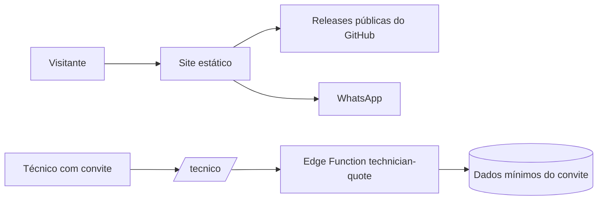

# Documentação completa — site comercial Assistência Simplificada

Versão de referência: `9.1.2`.

Esta source reúne o site público, o botão de download e o portal temporário usado pelo técnico. A maior parte do site é estática. Não há login comercial, checkout, banco próprio, analytics ou formulário de coleta. O portal `/tecnico/` é uma exceção deliberada: ele chama uma Edge Function do projeto do proprietário usando um convite aleatório e temporário.

## 1. Arquitetura

| Item | Estado atual |
|---|---|
| Autoria | Next.js App Router 16.3.2, React 19.2.8 |
| Build | Vinext/Vite em modo GitHub Pages |
| Saída pública | `dist/client` |
| Hospedagem | GitHub Pages, domínio próprio `assistenciasimplificada.site` |
| Versão anunciada | `9.1.2` em `lib/site-data.ts` |
| Download | API pública de Releases do GitHub; aceita somente o instalador do repositório oficial |
| Compra/suporte | links HTTPS do WhatsApp com texto pré-preenchido |
| Portal técnico | HTML/CSS/JS estático em `public/tecnico/`, com API remota protegida por token de 24 horas |



O site comercial não recebe credenciais do aplicativo nem autoridade administrativa. O portal técnico recebe somente o token presente no link, limita o conteúdo ao atendimento convidado e nunca altera automaticamente o orçamento local.

## 2. Rotas

| Rota | Função |
|---|---|
| `/` | apresentação, recursos, imagens e download |
| `/recursos` | catálogo de funções da versão atual |
| `/planos` | planos e contato assistido |
| `/guia` | manual pesquisável |
| `/faq` | dúvidas de compatibilidade, dados, licença e suporte |
| `/privacidade` | política de privacidade |
| `/termos` | condições de uso |
| `/tecnico/` | diagnóstico e valores por convite individual de 24 horas |
| `/robots.txt`, `/sitemap.xml` | indexação e URLs canônicas |

`app/layout.tsx` define metadata, header, footer e assets globais. `lib/site-data.ts` centraliza nome, versão, URL, planos, WhatsApp, recursos e repositório de download. `app/components/download-app-button.tsx` consulta releases sem credenciais, valida host/nome do EXE e usa fallback para a página oficial.

## 3. Portal do técnico

Arquivos: `public/tecnico/index.html`, `page.css` e `page.js`.

Fluxo:

1. o aplicativo cria um convite individual no backend;
2. o link contém um token aleatório com validade de 24 horas;
3. o técnico abre `/tecnico/?token=...` em qualquer rede com acesso à internet;
4. a Edge Function devolve somente dados necessários do serviço;
5. o técnico informa defeito constatado e valor de cada serviço;
6. o aplicativo mostra uma pendência de revisão; nada é aplicado automaticamente.

Controles confirmados na source: HTTPS, CSP restritiva na página, validação local do formato do token, validação/expiração no servidor, limite de requisições e ausência de cookies/sessão do aplicativo. O token deve ser tratado como credencial temporária: não registrar em analytics, logs, screenshots ou referer externo. Alterações no domínio exigem atualizar CORS e a URL gerada pelo aplicativo/Edge Function em conjunto.

## 4. Configuração comercial

Edite `lib/site-data.ts` para nome, versão, WhatsApp, planos e recursos. Ao mudar a versão, compare também:

- instalador realmente publicado;
- guia, FAQ, termos e privacidade;
- screenshots e textos de recursos;
- notas de release;
- repositório/asset aceito pelo botão de download;
- URL e CORS do portal técnico.

A identidade oficial fica em `public/assets/branding`: logotipos horizontal e vertical para fundos claros e escuros, símbolo, ícones 192/512, favicon e imagem social. O cabeçalho e o rodapé usam o logotipo horizontal para fundo escuro; favicon e ícones usam o símbolo oficial. A paleta segue azul-marinho, ciano e dourado, e a tipografia principal é Segoe UI com fallback para Inter. Alterações nesses arquivos devem permanecer sincronizadas com o kit `Assistencia-Simplificada-Identidade-Visual` entregue ao proprietário.

O site não realiza cobrança e não confirma se uma mensagem do WhatsApp foi enviada. Analytics, checkout ou formulário futuro exigem nova revisão de privacidade e segurança.

## 5. Build e publicação

```text
pnpm install --frozen-lockfile
pnpm lint
GITHUB_PAGES=true pnpm build
```

No PowerShell, use `$env:GITHUB_PAGES = "true"` antes do build. A saída publicável é `dist/client`, com `.nojekyll`. Não publique `.git`, `app`, `lib`, `tools`, `node_modules`, lockfiles, `dist/server`, variáveis locais ou qualquer source.

O repositório público é `AssistenciaSimplificada/AssistenciaSimplificada.github.io`, branch `main`, raiz da branch. O repositório recebe somente uma cópia limpa de `dist/client`. Após a publicação, confira `/`, todas as rotas, `/tecnico/`, download, WhatsApp, canonical, sitemap, imagens e layout móvel.

## 6. Variáveis

| Variável | Uso |
|---|---|
| `NEXT_PUBLIC_SITE_URL` | URL canônica pública |
| `NEXT_PUBLIC_BASE_PATH` | prefixo quando houver publicação em subpasta; vazio no domínio principal |
| `GITHUB_PAGES` | seleciona o build estático do Pages |

Não há segredo necessário no bundle. Nunca usar `NEXT_PUBLIC_*` para service role, token administrativo, chave privada ou credencial de demonstração.

## 7. Segurança e privacidade

- React escapa textos; não há HTML remoto executado.
- O site não usa cookies de sessão, autenticação, banco próprio ou scripts de analytics.
- Links externos usam HTTPS e são centralizados.
- Screenshots e documentos devem conter somente dados fictícios e metadata limpa.
- O botão de download aceita somente host, repositório e tipo de arquivo previstos.
- O portal técnico mantém CSP e comunicação HTTPS com a função do proprietário.
- GitHub Pages não permite todos os headers customizados; por isso a proteção principal do portal está no token temporário, na API e na minimização do conteúdo.

Riscos residuais: indisponibilidade do GitHub/Supabase, compartilhamento indevido do link temporário, conteúdo comercial desatualizado e ausência de headers avançados no Pages. O portal não deve ganhar funções administrativas ou exibir dados além do convite.

## 8. Checklist de manutenção

- versão/nome iguais no site, app, instalador e notas;
- build Pages limpo e sem source;
- todas as rotas e imagens abrindo por HTTPS;
- download apontando para `AssistenciaSimplificada/Orcamentos-Atualizacoes`;
- convite técnico expirando e sem alteração automática do orçamento;
- CORS restrito ao domínio oficial;
- nenhum dado real em assets;
- nenhum segredo ou comentário interno na interface pública;
- política de privacidade revisada após qualquer nova coleta.
